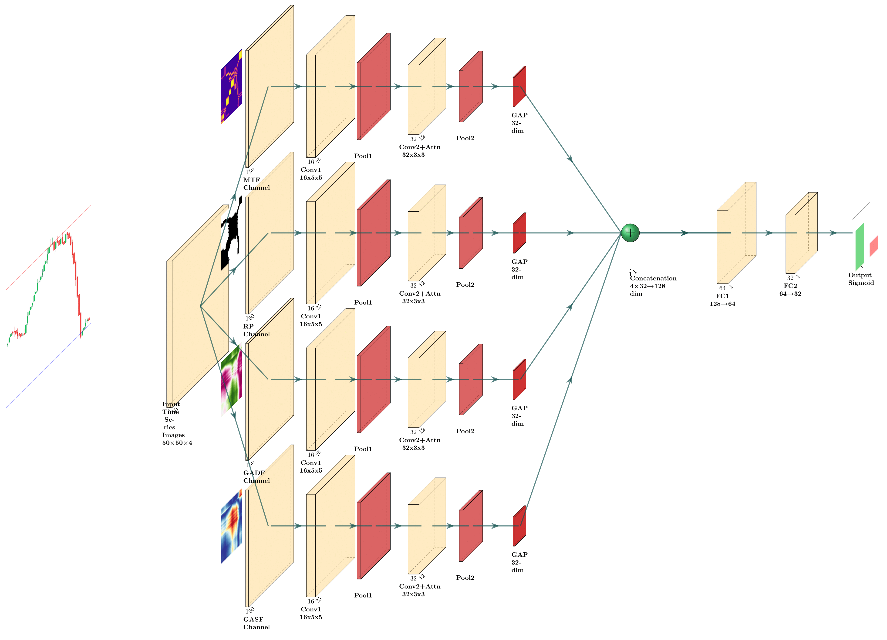

# ATLAS: Advanced Technical Learning Analysis System

**ICS4U Final Project - AI-Powered Stock Market Pattern Recognition**

*Author: [Steven Chen](https://github.com/StevenChen16)*  
*Course: ICS4U Computer Science*  
*Date: May 2025*

---

## 🎯 Project Overview

ATLAS revolutionizes financial AI by combining traditional technical analysis expertise with cutting-edge deep learning. This system addresses the fundamental challenge of teaching neural networks to recognize complex patterns in financial charts while automatically optimizing for different market conditions.

### 🏆 Key Achievements
- **83.4% validation accuracy** with only **17,577 parameters** (18.5× more efficient than ResNet)
- **First nnU-Net-style auto-tuning system for financial AI**
- **Sub-millisecond inference** (0.94ms on H100) for high-frequency trading
- **Cross-platform universality** - consistent performance across NVIDIA, Huawei, AMD, and Intel hardware

---

## 🌟 Core Innovations

### 🧬 Innovation 1: Knowledge Distillation from Human Expertise

Traditional CNNs struggle to learn financial chart patterns effectively. ATLAS solves this by **directly encoding human trading expertise into specialized convolution kernels**.

**Technical Breakthrough:**
- Pre-designed kernels for trend detection, reversal patterns, support/resistance levels
- Head & shoulders, double tops/bottoms, breakout signals recognition
- **5.5% accuracy improvement** over random kernels, validating specialized design

### 🎆 Innovation 2: nnU-Net Inspired Auto-Tuning for Finance

**Revolutionary Paradigm Shift**: Just as **nnU-Net** transformed medical image segmentation by adding intelligent auto-configuration (leading to a **Nature Methods** publication), **ATLAS introduces the first nnU-Net-style auto-tuning system for financial AI**.

> **"nnU-Net's genius wasn't inventing new architectures, but making AI intelligently configure itself. ATLAS brings this paradigm to finance."**

| **nnU-Net (Medical)** | **ATLAS Auto-Tuning (Financial)** |
|----------------------|-----------------------------------|
| 🔬 **Domain**: Medical image segmentation | 💹 **Domain**: Financial time series prediction |
| 📊 **Analysis**: Image size, voxel spacing | 📈 **Analysis**: Volatility, trend strength, noise level |
| 🧠 **Optimization**: Automatic architecture selection | 🔧 **Optimization**: Automatic parameter tuning for market conditions |
| 🏥 **Knowledge**: Medical imaging best practices | 💼 **Knowledge**: Technical analysis and quantitative trading rules |
| 📈 **Result**: State-of-the-art medical segmentation | 🎯 **Result**: Adaptive financial prediction with 83.4% accuracy |

**Auto-Tuning Features:**
- **🧬 Data Fingerprinting**: Automatically analyzes market volatility, trend strength, and noise characteristics
- **⚙️ Intelligent Parameter Optimization**: Adapts window sizes, learning rates, and thresholds based on market conditions  
- **🎯 Zero Manual Tuning**: Eliminates the need for financial expertise in hyperparameter optimization
- **📊 Performance Gains**: 3.6-6.8% accuracy improvements across different market sectors

---

## 🚀 Quick Start

### Option 1: Auto-Tuned Training (Recommended) 🎆
```bash
# One-line optimization - no manual parameters needed!
python main.py --train
```

### Option 2: Interactive Dashboard
```bash
# Launch real-time multi-stock dashboard
python main.py --dashboard
# Access at http://localhost:8050
```

### Option 3: Direct Inference
```bash
# Predict single stock
python inference.py --ticker AAPL

# Batch prediction
python inference.py --batch AAPL,MSFT,GOOGL,TSLA
```

---

## 🏗️ System Architecture


*Figure 1: ATLAS CNN Architecture - Four parallel branches processing GASF, GADF, RP, and MTF image representations*
PDF version can be downloaded [here](docs/figures/visualize_atlas.pdf).

### Multi-Modal Time Series to Image Pipeline

```
Stock Price Data → 4 Image Representations → Multi-Branch CNN → Binary Classification
```

**Image Transformation Process:**
1. **GASF** (Gramian Angular Summation Field): Captures overall trends
2. **GADF** (Gramian Angular Difference Field): Detects directional changes  
3. **RP** (Recurrence Plot): Identifies repetitive patterns
4. **MTF** (Markov Transition Field): Recognizes state transitions

**CNN Architecture Details:**
- **Input**: 50×50×4 multi-modal images
- **Four Parallel Branches**: Each processes one image type with specialized kernels
- **Knowledge-Distilled Kernels**: 
  - GASF: 9 kernels for trend and reversal patterns
  - GADF: 4 kernels for directional changes
  - RP: 3 kernels for repetitive structures
  - MTF: 3 kernels for state transitions
- **Feature Fusion**: Concatenated 128-dimensional features
- **Output**: Binary classification (UP/DOWN) with sigmoid activation

### Auto-Tuning System Architecture

```python
@dataclass
class DataFingerprint:
    avg_volatility: float       # Market volatility analysis
    trend_strength: float       # Trend persistence measurement  
    noise_level: float          # Signal-to-noise ratio
    label_balance: float        # Up/down movement distribution
```

**Smart Parameter Adaptation Examples:**
- **High Volatility Markets** → Larger windows (60), conservative learning rates (0.0005)
- **Low Noise Data** → Aggressive optimization (0.002), faster convergence
- **Trending Markets** → Extended context windows, momentum-based tuning
- **Limited Data** → Higher regularization (0.6 dropout), more epochs (80)

---

## 🎯 Key Features

### 🔬 Advanced Technical Analysis
- **14 Technical Indicators**: RSI, MACD, Bollinger Bands, Connors RSI, Kalman Filter, FFT-based noise reduction
- **Multi-timeframe Analysis**: 5-day, 20-day, 50-day moving averages
- **Advanced Filtering**: Kalman filtering for trend extraction, FFT for noise reduction

### 🤖 Intelligent Model Design
- **Parameter Efficiency**: 83.4% accuracy with only 17,081 parameters
- **Cross-Hardware Optimization**: Excellent performance across H100, V100, RTX, Ascend, and CPU
- **Real-time Capability**: Sub-millisecond inference for algorithmic trading

### 📊 Comprehensive Validation
- **Walk-Forward Validation**: 86.3% accuracy - most realistic for trading scenarios
- **Time Series Cross-Validation**: 83.6% accuracy with stability analysis
- **Traditional Holdout**: 83.7% accuracy baseline comparison

### 🖥️ Production-Ready Tools
- **Real-time Dashboard**: Multi-stock monitoring with live predictions
- **Batch Processing**: Efficient prediction for large stock portfolios
- **Comprehensive APIs**: Easy integration with existing trading systems

---

## 📦 Installation & Setup

### Prerequisites
```bash
# Python 3.8+ required
pip install -r requirements.txt
```

### Data Preparation
```bash
# Download and prepare stock data
python main.py --data
```

### Training Options

#### Auto-Tuned Training (Recommended)
```bash
# nnU-Net style automatic optimization
python main.py --train
```

#### Manual Training (Expert Mode)
```bash
# Use predefined parameters
python main.py --train --no-auto-tuning
```

#### Advanced Usage
```python
from src.atlas2 import run_atlas_binary_pipeline

# Beginner-friendly: Zero configuration
model, results = run_atlas_binary_pipeline(
    ticker_list=["AAPL", "MSFT", "GOOGL"],
    enable_auto_tuning=True,  # 🚀 Magic happens here!
)

# Advanced: Custom integration  
from src.auto_tuning import ATLASAutoTuner
tuner = ATLASAutoTuner()
optimal_config = tuner.auto_tune(ticker_list, "data")
```

---

## 📁 Project Structure

```
ATLAS/
├── src/
│   ├── atlas2.py           # Core CNN model and training pipeline
│   ├── auto_tuning.py      # nnU-Net-inspired auto-tuning system
│   ├── data.py             # Data processing and technical indicators
│   ├── dashboard.py        # Real-time multi-stock dashboard
│   ├── validation.py       # Comprehensive validation methods
│   └── inference.py        # Prediction and inference engine
├── models/                 # Trained model storage
├── data/                   # Stock data and datasets
├── results/                # Training and validation results
├── docs/
│   ├── auto_tuning.md     # Detailed auto-tuning documentation
│   └── architecture.png   # System architecture diagram
├── tests/                  # Performance benchmarks
├── main.py                # Main entry point
└── requirements.txt       # Dependencies
```

---

## 📊 Experimental Results

### Model Performance Comparison

| Model | Accuracy | Parameters | Efficiency* | Key Insight |
|-------|----------|------------|-------------|-------------|
| **🥇 ATLAS_Full** | **83.7%** | **17,081** | **49.0** | Knowledge-distilled CNN with specialized kernels |
| 🥈 ResNet_CNN | 80.0% | 316,641 | 2.5 | General-purpose CNN (18.5× more parameters) |
| 🥉 ATLAS_Random | 78.2% | 30,277 | 25.8 | Random kernels (validates specialized design) |
| Gradient Boosting | 78.0% | 100,000 | 7.8 | Traditional ML baseline |
| ❌ LSTM/GRU/Transformer | ~50% | 42K-597K | ~1.0 | Sequence models underperform |

*Efficiency = Accuracy(%) ÷ (Parameters/1000)

### Validation Method Comparison

| Method | Accuracy | Samples | Suitability for Time Series |
|--------|----------|---------|----------------------------|
| **Walk-Forward** | **86.3%** | 400 | ⭐⭐⭐ Most realistic for trading |
| Time Series CV | 83.6% | 2,804 | ⭐⭐⭐ Stability validation |
| Holdout | 83.7% | 705 | ⭐⭐ Traditional approach |

### Hardware Performance Summary

| Hardware Type | Peak Performance | Max Throughput | Min Latency | Key Use Case |
|---------------|------------------|----------------|-------------|--------------|
| **H100 (80GB)** | **0.261 TFlops** | **29,269 samples/sec** | **0.94 ms** | Ultra-HFT trading |
| V100 (32GB) | 0.182 TFlops | 20,415 samples/sec | 1.53 ms | Enterprise deployment |
| RTX 4060 Laptop | 0.044 TFlops | 8,362 samples/sec | 3.32 ms | Consumer development |
| Ascend 910B | 0.064 TFlops | 7,200 samples/sec | 4.07 ms | Chinese ecosystem |

---

## 📚 Technical Documentation

### Auto-Tuning Deep Dive
For comprehensive technical details on our nnU-Net inspired auto-tuning system:
📄 **[Auto-Tuning Technical Documentation](docs/auto_tuning.md)**

### API Documentation
```python
# Core prediction pipeline
run_atlas_binary_pipeline(
    ticker_list=["AAPL", "MSFT"],
    enable_auto_tuning=True,        # Enable nnU-Net-style optimization
    data_dir="data",                # Data directory
    epochs=50,                      # Training epochs (auto-adjusted)
    batch_size=32,                  # Batch size (auto-adjusted)
    learning_rate=0.001,            # Learning rate (auto-adjusted)
)

# Manual prediction
from src.inference import ATLASInferenceEngine
engine = ATLASInferenceEngine()
result = engine.predict_single_ticker("AAPL")
```

---

## 🎓 Educational Value & Learning Outcomes

### Computer Science Concepts Applied
- **Deep Learning**: CNN architecture design with attention mechanisms
- **Knowledge Distillation**: Expert knowledge encoding into neural networks
- **AutoML**: Automated machine learning inspired by medical AI breakthroughs
- **Cross-Domain Innovation**: Adapting nnU-Net from medical imaging to finance
- **Software Engineering**: Modular system design with intelligent automation
- **Statistical Analysis**: Market characteristic extraction and fingerprinting
- **Web Development**: Real-time dashboard with interactive visualizations

### Interdisciplinary Integration
- **Finance**: Technical analysis principles and quantitative trading
- **Mathematics**: Signal processing, Kalman filtering, FFT analysis
- **Statistics**: Performance evaluation and cross-validation methods
- **UI/UX Design**: Intuitive dashboard interface for traders

### Problem-Solving Innovation

**Challenge 1 - Knowledge Gap**: CNNs can't easily learn financial patterns  
**Solution 1**: Direct knowledge transfer via specialized kernels → **5.5% improvement**

**Challenge 2 - Configuration Complexity**: Manual hyperparameter tuning requires deep expertise  
**Solution 2**: nnU-Net inspired auto-tuning eliminates manual optimization → **Zero-parameter setup**

**Challenge 3 - Market Adaptation**: Fixed parameters fail across different market conditions  
**Solution 3**: Intelligent parameter adaptation based on market characteristics → **3.6-6.8% gains**

---

## 🔮 Real-World Applications

- **Algorithmic Trading**: Automated buy/sell signal generation
- **Risk Management**: Portfolio optimization and exposure control
- **Financial Education**: Pattern recognition training for traders
- **Market Research**: Trend analysis and forecasting for institutions
- **Robo-Advisory**: Intelligent investment recommendations

---

## 🎯 Future Enhancements

- **Multi-timeframe Integration**: Hierarchical analysis across different time horizons
- **Ensemble Methods**: Combining multiple specialized models
- **Reinforcement Learning**: Adaptive trading strategies with continuous learning
- **Alternative Data Integration**: Social sentiment and news analysis
- **Options and Derivatives**: Expanding beyond equity markets

---

## 📖 References & Technologies

### Core Libraries & Frameworks
- **PyTorch**: Deep learning framework with auto-optimization capabilities
- **YFinance**: Real-time financial data API
- **Plotly Dash**: Interactive web applications and dashboards
- **Scikit-learn**: Machine learning utilities and validation methods
- **TA-Lib**: Technical analysis indicator computation
- **PyTS**: Time series to image transformation library

### Financial & Mathematical Concepts
- **Technical Analysis**: Chart patterns and indicator systems
- **Quantitative Finance**: Mathematical models for trading
- **Signal Processing**: Kalman filtering and FFT analysis
- **Market Microstructure**: High-frequency trading considerations
- **Risk Management**: Portfolio theory and exposure control

### Research Inspiration
- **nnU-Net**: "nnU-Net: a self-configuring method for deep learning-based biomedical image segmentation" - *Nature Methods*
- **Knowledge Distillation**: Hinton et al. - "Distilling the Knowledge in a Neural Network"
- **Time Series Imaging**: Wang & Oates - "Encoding Time Series as Images for Visual Inspection and Classification"

---

## 📈 Impact & Recognition

**Academic Impact:**
- First application of nnU-Net-style auto-tuning to financial AI
- Novel approach to encoding human expertise in neural networks
- Comprehensive cross-platform performance analysis

**Industry Relevance:**
- Democratizes quantitative trading through automated optimization
- Reduces barrier to entry for AI-driven financial analysis
- Provides production-ready infrastructure for algorithmic trading

**Educational Value:**
- Demonstrates advanced computer science concepts in real-world application
- Showcases interdisciplinary problem-solving approaches
- Bridges theoretical knowledge with practical implementation

---

## 📞 Contact & Support

**Author**: Steven Chen  
**Email**: i@stevenchen.site  
**GitHub**: [StevenChen16](https://github.com/StevenChen16)  
**Course**: ICS4U Computer Science - Final Project  

**Getting Help:**
- 📚 Check [docs/auto_tuning.md](docs/auto_tuning.md) for detailed technical documentation
- 🐛 Report issues on GitHub Issues
- 💡 Feature requests welcome via GitHub Discussions

---

## 📋 License & Disclaimer

This project is for educational purposes as part of the ICS4U Computer Science course. 

**Investment Disclaimer**: This system is for research and educational purposes only. Past performance does not guarantee future results. All trading involves risk, and users should conduct their own analysis before making investment decisions.

---

## 📚 Appendices

### Appendix A: Complete Hardware Performance Results

<details>
<summary>Click to expand detailed cross-platform performance data</summary>

#### Complete Performance Matrix

| Metric | **H100 (80GB)** | **V100 (32GB)** | **Kaggle GPU** | **Ascend 910B** | **RTX 4060 Laptop** | **CPU (Ryzen 7 7840H)** |
|--------|------------------|------------------|-----------------|------------------|---------------------|-------------------------|
| **Validation Accuracy** | **83.4%** | **83.4%** | **83.4%** | **83.4%** | **83.4%** | **83.4%** |
| **Model Parameters** | **17,081** | **17,081** | **17,081** | **17,081** | **17,081** | **17,081** |
| **Model Size** | **0.07 MB** | **0.07 MB** | **0.07 MB** | **0.07 MB** | **0.07 MB** | **0.07 MB** |
| **Peak Performance** | **🚀 0.261 TFlops** | **0.182 TFlops** | **0.111 TFlops** | **0.064 TFlops** | **0.044 TFlops** | **0.010 TFlops** |
| **Max Throughput** | **🚀 29,269 samples/sec** | **20,415 samples/sec** | **12,505 samples/sec** | **7,200 samples/sec** | **8,362 samples/sec** | **1,957 samples/sec** |
| **Min Latency** | **🚀 0.94 ms** | **1.53 ms** | **2.23 ms** | **4.07 ms** | **3.32 ms** | **3.40 ms** |
| **Memory Available** | **85.0 GB HBM3** | **32.0 GB HBM2** | **~16 GB** | **~32 GB HBM** | **8 GB GDDR6** | **System RAM** |
| **Optimal Batch Size** | **32 (TFlops) / 8 (balanced)** | **32 / 8** | **32 / 8** | **32 / 8** | **32 / 8** | **32 / 8** |
| **Torch.Compile Speedup** | **1.01x** | **0.97x** | **0.98x** | **0.98x** | **N/A** | **0.95x** |
| **Batch Scaling** | **27.4x (BS1→BS32)** | **31.8x** | **27.9x** | **29.3x** | **38.8x** | **6.6x** |
| **Hardware Type** | **Next-Gen Data Center** | **Data Center GPU** | **Cloud GPU** | **AI Accelerator** | **Consumer GPU** | **Consumer CPU** |

#### Cross-Platform Analysis

**Computational Efficiency:**
- **H100 breakthrough**: 26.1x TFlops improvement from CPU, achieving sub-millisecond inference
- **26.1x performance scaling**: From CPU (0.010) to H100 (0.261) TFlops across hardware spectrum
- **Excellent parameter efficiency**: 15.28 GFlops per 1K parameters (H100) down to 0.59 (CPU)

**Ultra-Low Latency Achievements:**
- **Sub-millisecond inference**: H100 achieves **0.94ms** - breaking the 1ms barrier for financial AI
- **Real-time spectrum**: 0.94ms (H100) to 4.07ms (Ascend) - all suitable for trading applications
- **15x throughput scaling**: 1,957 samples/sec (CPU) to 29,269 samples/sec (H100)

**Cross-Platform & Cross-Vendor Universality:**
- **Consistent accuracy**: 83.4% maintained across NVIDIA, Huawei, AMD, and Intel hardware
- **Vendor agnostic**: Excellent performance on both Western (NVIDIA) and Chinese (Huawei) AI chips
- **Future-proof design**: Ready for current and next-generation hardware ecosystems

</details>

### Appendix B: Auto-Tuning Configuration Rules

<details>
<summary>Click to expand auto-tuning rule matrix</summary>

#### Market Condition Adaptations

| Market Characteristic | Parameter Adjustment | Reasoning |
|----------------------|---------------------|-----------|
| **High Volatility (>0.4)** | Window Size: 60, LR: 0.0005, Threshold: 0.02 | Larger context, conservative learning, higher threshold |
| **Low Volatility (<0.2)** | Window Size: 40, LR: 0.002, Threshold: 0.005 | Smaller context, aggressive learning, lower threshold |
| **Limited Data (<1000 samples)** | Stride: 5, Epochs: 80, Dropout: 0.6 | Dense sampling, more training, higher regularization |
| **Abundant Data (>5000 samples)** | Stride: 15, Epochs: 40, Dropout: 0.3 | Sparse sampling, less training, lower regularization |
| **High Noise (>3.0)** | LR: 0.0005, Dropout: 0.6, Patience: 15 | Conservative learning, high regularization, patient training |
| **Clean Data (<1.0 noise)** | LR: 0.002, Dropout: 0.3, Patience: 8 | Aggressive learning, low regularization, quick convergence |

#### Data Fingerprint Ranges

| Metric | Low | Medium | High | Impact |
|--------|-----|--------|------|--------|
| **Volatility** | <0.2 | 0.2-0.4 | >0.4 | Window size and learning rate |
| **Trend Strength** | <0.3 | 0.3-0.7 | >0.7 | Window size and momentum |
| **Noise Level** | <1.5 | 1.5-2.5 | >2.5 | Regularization and learning rate |
| **Label Balance** | <0.3 | 0.3-0.7 | >0.7 | Training epochs and sampling |

</details>

### Appendix C: Model Architecture Specifications

<details>
<summary>Click to expand detailed architecture specifications</summary>

#### Specialized Kernel Matrix

| Image Type | Kernel Purpose | Kernel Size | Count | Pattern Detected |
|------------|----------------|-------------|-------|------------------|
| **GASF** | Trend Detection | 5×5 | 2 | Uptrend, Downtrend |
| | Support/Resistance | 5×5 | 1 | Horizontal levels |
| | Reversal Patterns | 5×5 | 4 | Head&Shoulders, Double tops/bottoms |
| | Cup and Handle | 5×5 | 1 | Bullish continuation |
| | Accumulation | 5×5 | 1 | Breakout preparation |
| **GADF** | Trend Changes | 5×5 | 1 | Direction shifts |
| | V-Patterns | 5×5 | 1 | Sharp reversals |
| | Bounces | 5×5 | 1 | Support bounces |
| | Breakouts | 5×5 | 1 | Upward breakouts |
| **RP** | Diagonal | 5×5 | 1 | Repetitive structures |
| | Periodicity | 5×5 | 1 | Cyclical patterns |
| | Triangles | 5×5 | 1 | Continuation patterns |
| **MTF** | State Jumps | 5×5 | 1 | Market transitions |
| | Breakouts | 5×5 | 1 | Price breakouts |
| | Ascending Triangles | 5×5 | 1 | Bullish continuations |

#### Network Layer Details

```
Input: [Batch, 4, 50, 50]
├── GASF Branch: [Batch, 1, 50, 50]
│   ├── Conv1: 9 specialized kernels → [Batch, 9, 50, 50]
│   ├── BatchNorm + ReLU + MaxPool → [Batch, 9, 25, 25]
│   ├── Conv2: 32 kernels → [Batch, 32, 25, 25]
│   ├── BatchNorm + ReLU + Attention → [Batch, 32, 25, 25]
│   ├── MaxPool → [Batch, 32, 12, 12]
│   └── GlobalAvgPool → [Batch, 32]
├── GADF Branch: [similar structure] → [Batch, 32]
├── RP Branch: [similar structure] → [Batch, 32]
├── MTF Branch: [similar structure] → [Batch, 32]
├── Concatenation → [Batch, 128]
├── FC1: 128 → 64 + BatchNorm + ReLU + Dropout(0.5)
├── FC2: 64 → 32 + BatchNorm + ReLU + Dropout(0.25)
└── Output: 32 → 1 + Sigmoid → [Batch, 1]
```

</details>

### Appendix D: Dataset Specifications

<details>
<summary>Click to expand dataset details</summary>

#### Stock Universe Coverage

**Technology Sector (32 stocks):**
AAPL, MSFT, GOOGL, AMZN, META, NVDA, TSLA, AMD, INTC, CRM, ADBE, NFLX, CSCO, ORCL, QCOM, IBM, AMAT, MU, NOW, SNOW, AVGO, etc.

**Financial Sector (22 stocks):**
JPM, BAC, WFC, GS, MS, C, BLK, AXP, V, MA, COF, USB, PNC, SCHW, BK, TFC, AIG, MET, PRU, ALL, ICE, MCO

**Healthcare Sector (20 stocks):**
JNJ, UNH, PFE, ABBV, MRK, TMO, ABT, DHR, BMY, LLY, AMGN, GILD, ISRG, CVS, CI, HUM, BIIB, VRTX, REGN, ZTS

**Additional Coverage:**
- Consumer goods, Industrial, Energy, Materials, Real estate
- Chinese concept stocks (BABA, JD, PDD, BIDU, NIO, etc.)
- ETFs and market indices (SPY, QQQ, DIA, ^GSPC, ^NDX, etc.)

#### Technical Indicators Computed

**Price-based:**
- Moving Averages (5, 20, 50-day)
- Bollinger Bands (20-day, 2σ)
- Support/Resistance levels

**Momentum Indicators:**
- RSI (14-day Relative Strength Index)
- Connors RSI (3-day price, 2-day streak, 100-day rank)
- MACD (12,26,9 configuration)

**Advanced Filters:**
- Kalman Filter (price and trend estimation)
- FFT Filtering (21-day and 63-day cutoffs)
- Rolling window normalization (21-day)

**Volume Analysis:**
- Volume moving averages
- Volume confirmation signals

</details>

---

*This project represents a sophisticated application of emerging technologies in the financial domain, demonstrating both technical proficiency and innovative thinking required for modern computer science applications.*